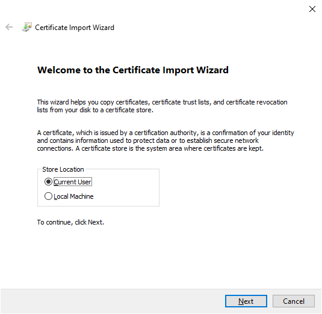
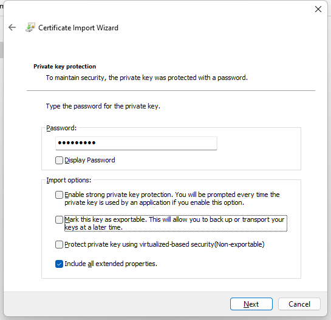
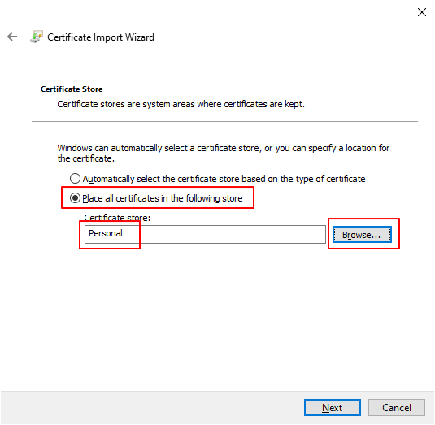
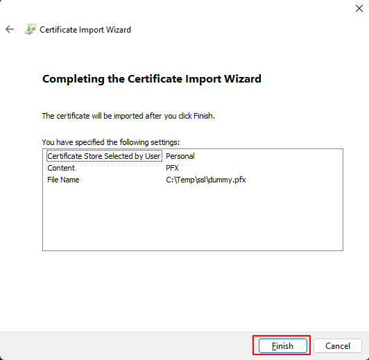

# SecuredConfig.Core
This project is mainly for extending .NET Core Configuration to support mixed encrypted configuration values.

## Introduction
In .NET Core, there is no built-in configuration protection or encryption offically provided from Microsoft.
Therefore, several configuration encryption libraries were developed from communities. 
However, most of those configuration encryption libraries only support field level or file level content encryption, but not partial content in a configuration value.
For example, a Connection String usually looks like this `Data Source=(local);Initial Catalog=MyDB;User ID=sa;Password=mysecret`.
Most of the time we just want to protect the credential (e.g. the password `mysecret` from above example), 
we still want to keep other informations like the data source and DB name visible for better troubleshooting, 
but most of those libraries will encrypt the whole connection string. In case we just want to check whether the DB server is pointed to correctly or not, we still need to decrypt the whole connection string.
That's why this library was created in order to support partial encryption over configuration values from any ConfigurationSource (e.g. appsettings.json, Environment varibles, etc.), 
and it will not affect your configuration utilization since it's basically transparent to your program.

## Prepare your PFX certificate with private key
The PFX certificate can be created by self signed or issued by a trusted CA (recommended for production).
Here is an example to generate PFX certificate with private key using Openssl:
```
openssl genrsa 2048 > private.key

openssl req -new -x509 -nodes -sha256 -days 365 -key private.key > public.cer

openssl pkcs12 -export -in public.cer -inkey private.key -out cert.pfx
```

## Encrypt the secret string using Command line tool
To install the SecuredConfig CLI, just execute `dotnet tool install -g SecuredConfig.Cli`. 
After that you can use it with the command `secured-config` from your command line.

To encrypt your secret value like "mysecret", just execute:
```
secured-config encrypt --cert public.cer -s "mysecret"
```

The encrypted value will be output like this:
`{Enc:CN=dummy,NotAfter=2033-04-25:3IAyMsx49Y7+rYLQONt+0w7tzleJdRQ5XDRIEuHJbKQoJM6U18t6eCQ9ECT0DzlW5hsqnqGDIUB0Udw8QYjhfc4yL03xY8oLYwRc6UP5T+3YyTuNsxNFxgSwtd0MIYt7NxZuDM/5mNzM9d5FxnnnpV/yz2FLtIbMV6gcwuKwa/ZP9fjSZAzWe3tajDYIBHOfq69UoQxl3ibV9a2dToqV0AG1t+qNGHJY4leiBauzElVEvrwhsGySD/PryVVXxnVwRq1rKWMbwoj7PqDnZ5ypefmqO2oY+zdwcKv6jIoZriUddAGni9VWkTDyZwVnrR9Rz1iR8Azm0QoywKfL5bQItQ==}`

Copy the encrypted value and replace your plain text `mysecret` in appsettings.json or environment variables.

## Certificate setup for decryption
### Add PFX Certificate to your LocalMachine or CurrentUser's Personal Store
#### 1. Double click your .pfx file, Select Current User and click Next button twice.



#### 2. Enter the password"




#### 3. Select "Place all certificates in the following store" and Click "Browse" to select "Personal" store.



#### 4. Click "Next" and then "Finish" button



### Add PFX Certificate in Linux (if application to run on Linux)
1. Login as (or `su <svc_account>`) the target service account
2. Run below commands and input the input pfx password:
``` bash
mkdir -p ~/.dotnet/corefx/cryptography/x509stores/my/
openssl pkcs12 -in cert.pfx -nodes | openssl pkcs12 -export -passout pass: -out ~/.dotnet/corefx/cryptography/x509stores/my/cert.pfx
```

## .NET Core Integration with transparent decryption
Install the nuget package `SecuredConfig.Core`
```
dotnet add package SecuredConfig.Core
```

### Modify your application to support transparent decryption

Just add `.UseSecuredConfiguration()` after `Host.CreateDefaultBuilder(args)`.
If you have customized configurations other than .NET Core defaults, please place `.UseSecuredConfiguration()` after `.ConfigureAppConfiguration(...)` in order to overlay all the configuration sources.

Example:
``` csharp
public class Program
{
    public static void Main(string[] args)
    {
        CreateHostBuilder(args).Build().Run();
    }

    public static IHostBuilder CreateHostBuilder(string[] args) =>
        Host.CreateDefaultBuilder(args)
            .UseSecuredConfiguration()  // <-- add this line
            .ConfigureWebHostDefaults(webBuilder =>
            {
                webBuilder.UseStartup<Startup>();
            });
}
```

.NET 6 Example:
``` csharp
var builder = WebApplication.CreateBuilder(args);

builder.Host.UseSecuredConfiguration();  // <-- add this line
builder.Services.Addxxxx();
...

var app = builder.Build();
app.UseRouting();
...
app.Run();
```


The corresponding appsettings.json may look like:
``` json
{
  "ConnectionStrings": {
    "Default": "Data Source=DBServer;Initial Catalog=Test;Password={Enc:CN=dummy,NotAfter=2033-04-25:vaAO17L+53RUA51Fhxo9Cg==};User ID=dev;",
  },
  "Logging": {
    "LogLevel": {
      "Default": "Debug",
      "System": "Information",
      "Microsoft": "Information"
    }
  }
}
```

* `{Enc:[cert title]:xxxxxxxxxxxxxxxxxxxxxxxxxxxx}` is the encrypted pattern. 
 Where "xxxxxxxxxxxxxxxxxxxxxxxxxxxx" is the RSA public key encrypted Base64 string and [cert title] will be used to search in Cert Store.

Later on when your code try to access `Configuration["ConnectionStrings:Default"]`, it will retrieve the Decrypted value automatically.

### Production Remarks
- Consider to install the Certificate into "Local Machine" instead of "Current User" to support different service accounts to access the certificate.
- Make sure the application service account has permission to read the Certificate's Private key.
- If the certificate can be found in `LocalMachine`, it will not search in `CurrentUser`

### Environment Variables
You can specify below Environment variables to override the default Certificate Store

#### CRYPTO_CERTIFICATE_STORE
The certificate store to lookup. Default is `"My"` (Personal store)


## How it works

### Overlay.SecuredConfigurationProvider
Extend [ConfigurationProvider](https://github.com/dotnet/runtime/tree/main/src/libraries/Microsoft.Extensions.Configuration)
and reference the concepts from [ChainedConfigurationProvider](https://github.com/dotnet/runtime/blob/main/src/libraries/Microsoft.Extensions.Configuration/src/ChainedConfigurationProvider.cs)
to create an overlayed configuration to wrap the given IConfiguration (usually built from ConfigurationBuilder)
and use regular express to detect whether there is encrypted value pattern then apply auto decryption over the underlying configurations.

You just need to add `.UseSecuredConfiguration()` to IHostBuilder during Main Program startup.
It will be transparent to all the configuration consumers.


